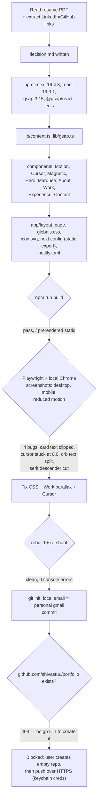
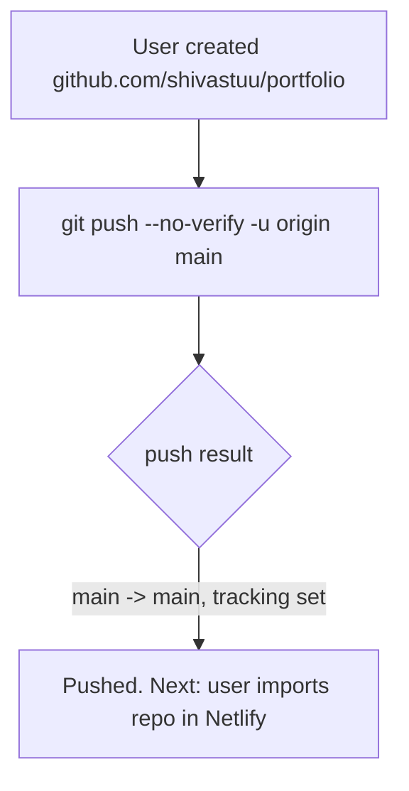
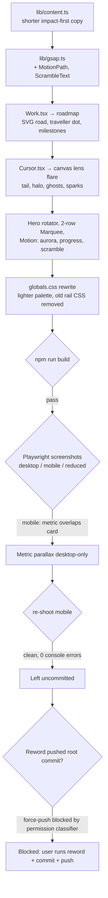

# Flow

## 2026-10-27 — Portfolio site (personal, no Jira)

```mermaid
flowchart TD
  A["Read resume PDF<br/>+ extract LinkedIn/GitHub links"] --> B["decision.md written"]
  B --> C["npm i next 16.4.3, react 19.3.1,<br/>gsap 3.15, @gsap/react, lenis"]
  C --> D["lib/content.ts, lib/gsap.ts"]
  D --> E["components: Motion, Cursor, Magnetic,<br/>Hero, Marquee, About, Work,<br/>Experience, Contact"]
  E --> F["app/layout, page, globals.css,<br/>icon.svg, next.config (static export),<br/>netlify.toml"]
  F --> G{"npm run build"}
  G -->|"pass, / prerendered static"| H{"Playwright + local Chrome<br/>screenshots: desktop, mobile,<br/>reduced motion"}
  H -->|"4 bugs: card text clipped,<br/>cursor stuck at 0,0, orb text split,<br/>serif descender cut"| I["Fix CSS + Work parallax + Cursor"]
  I --> J{"rebuild + re-shoot"}
  J -->|"clean, 0 console errors"| K["git init, local email = personal gmail<br/>commit"]
  K --> L{"github.com/shivastuu/portfolio exists?"}
  L -->|"404 — no gh CLI to create it"| M["Blocked: user creates empty repo,<br/>then push over HTTPS (keychain creds)"]
```

```mermaid
flowchart TD
  M["User created github.com/shivastuu/portfolio"] --> N["git push --no-verify -u origin main"]
  N --> O{"push result"}
  O -->|"main -> main, tracking set"| P["Pushed. Next: user imports repo in Netlify"]
```

## 2026-10-27 — Punchier copy, roadmap projects, flare cursor, lighter theme

```mermaid
flowchart TD
  A["lib/content.ts<br/>shorter impact-first copy"] --> B["lib/gsap.ts<br/>+ MotionPath, ScrambleText"]
  B --> C["Work.tsx → roadmap<br/>SVG road, traveller dot, milestones"]
  C --> D["Cursor.tsx → canvas lens flare<br/>tail, halo, ghosts, sparks"]
  D --> E["Hero rotator, 2-row Marquee,<br/>Motion: aurora, progress, scramble"]
  E --> F["globals.css rewrite<br/>lighter palette, old rail CSS removed"]
  F --> G{"npm run build"}
  G -->|"pass"| H{"Playwright screenshots<br/>desktop / mobile / reduced"}
  H -->|"mobile: metric overlaps card"| I["Metric parallax desktop-only"]
  I --> J{"re-shoot mobile"}
  J -->|"clean, 0 console errors"| K["Left uncommitted"]
  K --> L{"Reword pushed root commit?"}
  L -->|"force-push blocked by permission classifier"| M["Blocked: user runs reword + commit + push"]
```
